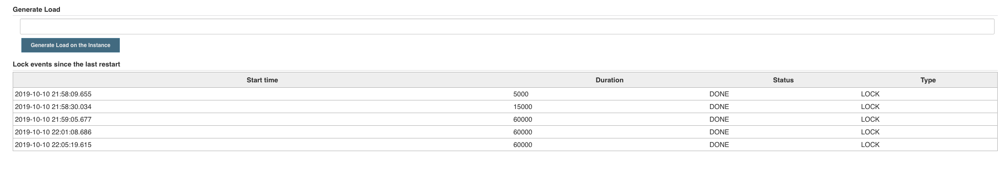

# Chaos Monkey Plugin

This plugin was written to help the development of a CLI tool interacting with Jenkins.
The need is to have a instance of Jenkins in a bad shape to gauge how the CLI handles it.

There are currently only 2 features:

* A latency injector, accessible from the Global Configuration of Jenkins:

* A queue locker accessible as a Global Action :

* A load generator (CPU) accessible as a Global Action:

## Warning

This plugin is for testing and development purposes and should never be installed on a production instance!

# Plan

* Review the way the CPU load is generated works on Kubernetes
* Add some memory load generator (and a leak generator)
* Add some http request load generator

## About the name of the plugin

It comes from the well known Netflix [Chaos Monkey tool](https://github.com/Netflix/chaosmonkey).
Thanks to Arnaud Héritier for suggesting it. 